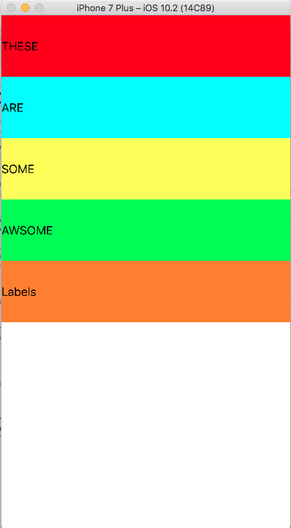
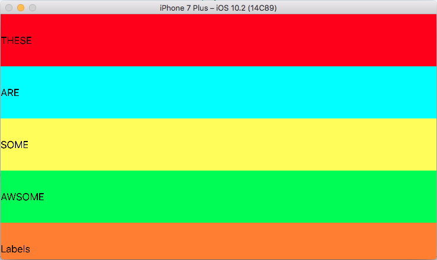
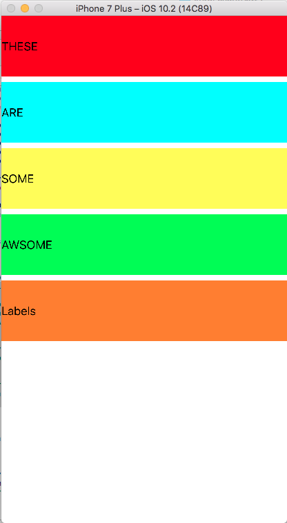
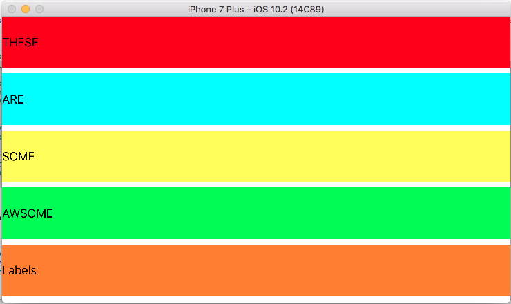

# AutoLayoutPart2

The Auto Layout Part 2 app demonstrates auto layout features using code. Both can be seen below. The first is the Visual Format Language and the seconf is the Anchor Layout. Note only method works when the app is running due to the other method's code being commented out. 

### Screenshots of the Auto Layout Part 2 App

                         Above: Screenshots of the Auto Layout via code in the AutoLayout app

